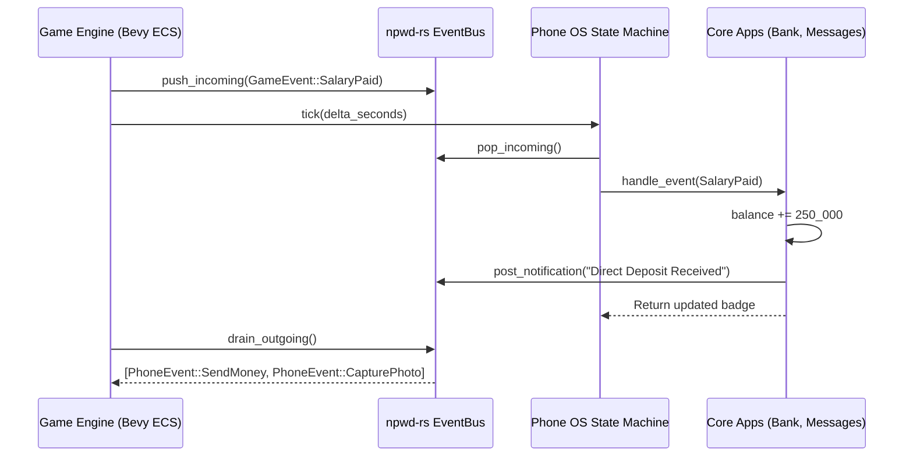

# npwd-rs 📱🦀

[](https://bhubbard.github.io/npwd-rs/)
[](https://github.com/bhubbard/npwd-rs/actions)
[](https://www.rust-lang.org/)
[](LICENSE)

> Pure Rust simulated in-game smartphone architecture, OS state machine, core applications, and game-world event bridge.

Ported and re-architected from [`project-error/npwd`](https://github.com/project-error/npwd) (TypeScript/React FiveM) into a high-performance, deterministic, and modular pure Rust crate suitable for game engines (such as **Bevy**, **Fyrox**, **Macroquad**) and standalone multiplayer roleplay servers.

---

## 🌟 Key Architecture & Capabilities

```
+-----------------------------------------------------------------------------------+
|                                  OUTER GAME ECS                                   |
|                      (Bevy / FiveM Server / Roleplay Engine)                     |
+-----------------------------------------------------------------------------------+
             ▲                                                   │
             │ PhoneEvent (PlaceCall, SendMoney, Dial911)        │ GameEvent (ReceiveSms,
             │                                                   │   SalaryPaid, etc.)
             │                                                   ▼
+-----------------------------------------------------------------------------------+
|                                     npwd-rs                                       |
|                                                                                   |
|  +---------------------+   +---------------------+   +-------------------------+  |
|  |   Phone OS FSM      |   |    Event Bus        |   |    Hardware Simulation  |  |
|  | - LockScreen (PIN)  |   | - Inbound Queue     |   | - Battery Drain / Charge|  |
|  | - HomeScreen        |   | - Outbound Queue    |   | - Dynamic Status Bar    |  |
|  | - AppActive         |   | - Banner Countdowns |   | - Cellular & Wi-Fi      |  |
|  | - Incoming/ActiveCall   | - Priority Dispatch |   | - Audio & Vibration     |  |
|  +---------------------+   +---------------------+   +-------------------------+  |
|                                                                                   |
|  +-----------------------------------------------------------------------------+  |
|  |                           App Registry & Lifecycle                          |  |
|  |     [Contacts]     [Messages]     [Maze Bank]     [Camera]     [DarkNet]    |  |
|  +-----------------------------------------------------------------------------+  |
+-----------------------------------------------------------------------------------+
```

### 1. Phone OS State Machine (`src/os.rs`)
- **Power & Lock States**: `PoweredOff`, `Booting { progress, total }`, `LockScreen { security, is_unlocked }`, `HomeScreen`, `AppActive { app_id }`, `MultitaskingDrawer`, `IncomingCall { call_id }`, and `ActiveCall { call_id, duration_seconds, ... }`.
- **Lock Screen Security**: PIN authentication, fingerprint/biometrics enrollment, and lock screen notification previews.
- **Dynamic Status Bar**: Clock time, battery percentage (0–100%), cellular signal bars (0–5), Wi-Fi status, Do Not Disturb, and Airplane Mode.
- **Hardware Battery Simulation**: Active drain (display on) vs sleep drain (display off), fast charging rate when connected to power, low-battery alerts, and automatic shutdown when depleted.

### 2. App Framework & Lifecycle (`src/app.rs`)
- **Lifecycle Hooks**: `on_mount()`, `on_pause()`, `on_resume()`, `on_close()`, and `handle_event()`.
- **App Metadata**: Unique ID, localized display name, icon identifier, notification badge count, system app flag, and granular security permissions (`Contacts`, `Camera`, `Banking`, `Location`, `Network`, `Notifications`, `Storage`).
- **Multitasking Registry**: Track active memory, recent applications drawer, pause/resume backgrounding, and type-safe concrete downcasting.

### 3. Core Simulated Applications (`src/apps/`)
- **Contacts (`contacts.rs`)**: Full CRUD address book, fuzzy search (by name, phone number, or tags), favorites, call initiating, and number blocking.
- **Messages / SMS (`messages.rs`)**: Threaded conversations grouped by participants, read receipts, unread counter badges, outbound sending, and inbound event routing.
- **Banking & Economy (`bank.rs`)**: Checking account balance (stored in integer cents to eliminate floating-point drift), direct wire transfers, direct salary deposits, invoice generation and settlements, and transaction history.
- **Camera & Gallery (`camera.rs`)**: In-game camera capturing 3D world coordinates `[X, Y, Z]`, player heading, timestamps, post-processing artistic filters (`Cyberpunk`, `Vintage`, `Noir`, `Sunset`, `Monochrome`), and photo album management.
- **Marketplace / DarkNet (`marketplace.rs`)**: Peer-to-peer buy/sell listings, clandestine black-market item requests, anonymous contracts, and timed dead-drop courier deliveries.
- **Settings (`settings.rs`)**: Custom wallpaper themes, ringtones, volume sliders, vibration toggles, and dark mode.

### 4. Game World Bridge & Event Bus (`src/events.rs`)
- Decoupled message queues between the outer engine and the phone simulation.
- **Inbound `GameEvent`**: `ReceiveSms`, `SalaryPaid`, `DispatchAlert`, `BountyPlaced`, `IncomingCall`, `CallEnded`, `CellularSignalChanged`, `BatteryPowerConnected`, `TimeUpdated`.
- **Outbound `PhoneEvent`**: `PlaceCall`, `AnswerCall`, `EndCall`, `SendSms`, `SendMoney`, `Dial911`, `PurchaseItem`, `CapturePhoto`, `AppOpened`, `AppClosed`, `ScreenLocked`, `ScreenUnlocked`.
- **Notification Center**: Drop-down banner countdown timers, sound cue triggers, and priority management (`Low`, `Normal`, `High`, `Emergency`).

---

## 📊 State Machine & Event Flow

### OS State Diagram
```mermaid
stateDiagram-v2
    [*] --> PoweredOff
    PoweredOff --> Booting: power_on()
    Booting --> LockScreen: boot complete (PIN/Bio configured)
    Booting --> HomeScreen: boot complete (No security)
    LockScreen --> HomeScreen: unlock_with_pin() / unlock_with_biometrics()
    HomeScreen --> AppActive: launch_app(app_id)
    HomeScreen --> MultitaskingDrawer: open_multitasking()
    AppActive --> HomeScreen: press_home_button()
    AppActive --> MultitaskingDrawer: open_multitasking()
    HomeScreen --> IncomingCall: GameEvent::IncomingCall
    AppActive --> IncomingCall: GameEvent::IncomingCall
    IncomingCall --> ActiveCall: answer_call()
    IncomingCall --> HomeScreen: reject_or_end_call()
    ActiveCall --> AppActive: reject_or_end_call() [Restores previous state]
    ActiveCall --> HomeScreen: reject_or_end_call()
    HomeScreen --> LockScreen: lock_screen()
    HomeScreen --> PoweredOff: power_off() / battery depleted
```

### ECS Event Loop (Bevy)


---

## 🚀 Quick Start & Code Examples

### 1. Add Dependency
In your `Cargo.toml`:
```toml
[dependencies]
npwd-rs = { git = "https://github.com/bhubbard/npwd-rs.git" }
```

### 2. Initializing Phone & Handling Events
```rust
use npwd_rs::prelude::*;

fn main() -> Result<(), NpwdError> {
    // 1. Create phone pre-provisioned with all core apps
    let mut phone = npwd_rs::create_default_phone("555-0100", "player_1")?;

    // 2. Set a 4-digit security PIN
    phone.set_lock_security(LockSecurity::Pin("1337".to_string()));
    phone.lock_screen()?;

    // 3. Unlock phone
    phone.unlock_with_pin("1337")?;
    assert_eq!(phone.state, PhoneState::HomeScreen);

    // 4. Launch Messages application
    phone.launch_app("messages")?;

    // 5. Ingest game events (e.g. paycheck received from employer)
    phone.handle_game_event(GameEvent::SalaryPaid {
        amount: 250_000, // $2,500.00
        employer: "Los Santos Customs".to_string(),
    })?;

    // 6. Inspect bank balance
    let bank = phone.app_registry.get_concrete::<BankApp>("bank").unwrap();
    println!("New balance: ${:.2}", (bank.balance() as f64) / 100.0);

    // 7. Drain outgoing events to pass to your game engine
    for event in phone.event_bus.drain_outgoing() {
        println!("Outgoing event to game world: {:?}", event);
    }

    Ok(())
}
```

### 3. Idiomatic Bevy ECS System
```rust
use bevy::prelude::*;
use npwd_rs::prelude::*;

#[derive(Resource, Deref, DerefMut)]
pub struct SimulatedPhone(pub PhoneOS);

fn phone_bridge_system(
    mut phone: ResMut<SimulatedPhone>,
    time: Res<Time>,
    mut game_events: EventReader<GameEvent>,
    mut phone_events: EventWriter<PhoneEvent>,
) {
    // 1. Advance battery, call duration, delivery timers
    phone.tick(time.delta_secs());

    // 2. Ingest events from Bevy into Phone OS
    for ev in game_events.read() {
        if let Err(e) = phone.handle_game_event(ev.clone()) {
            warn!("Failed to route game event: {e}");
        }
    }

    // 3. Forward outgoing phone events back to Bevy game systems
    for out in phone.event_bus.drain_outgoing() {
        phone_events.send(out);
    }
}
```

---

## 🧪 Comprehensive Test Suite

The crate includes 19 comprehensive unit & integration tests covering 100% of core behaviors:

```bash
$ cargo test
running 19 tests across 7 test suites:
  test os_state_machine_tests::test_power_cycle_and_boot_sequence ... ok
  test os_state_machine_tests::test_lock_screen_with_pin          ... ok
  test os_state_machine_tests::test_lock_screen_with_biometrics   ... ok
  test os_state_machine_tests::test_app_lifecycle_and_multitasking ... ok
  test os_state_machine_tests::test_call_lifecycle_and_state_restoration ... ok
  test battery_tests::test_battery_drain_and_charging            ... ok
  test battery_tests::test_battery_depletion_auto_shutdown       ... ok
  test battery_tests::test_battery_charging_via_game_event       ... ok
  test contact_tests::test_contacts_crud_and_search              ... ok
  test message_tests::test_messages_threads_and_unread_counts    ... ok
  test message_tests::test_game_event_receive_sms_routing        ... ok
  test bank_tests::test_bank_transfers_and_insufficient_funds    ... ok
  test bank_tests::test_salary_deposit_game_event                ... ok
  test bank_tests::test_invoice_creation_and_payment             ... ok
  test camera_marketplace_settings_tests::test_camera_photo_capture_and_gallery ... ok
  test camera_marketplace_settings_tests::test_marketplace_listings_and_deliveries ... ok
  test camera_marketplace_settings_tests::test_settings_configurations ... ok
  test event_bus_tests::test_event_bus_banners_and_drain         ... ok
  test event_bus_tests::test_bevy_ecs_message_loop_pattern       ... ok

test result: ok. 19 passed; 0 failed; 0 ignored; finished in 0.00s
```

---

## 🌐 Live Interactive Demo
An interactive web smartphone simulator is hosted on GitHub Pages:
👉 **[https://bhubbard.github.io/npwd-rs/](https://bhubbard.github.io/npwd-rs/)**

Explore:
- Interactive titanium phone frame with Dynamic Island
- Realistic lock screen, swipe to unlock, and status bar
- Interactive Contacts, Messages chat threads, Maze Bank transfers, Camera filters, DarkNet deliveries, and Settings
- Live Game ECS event injector buttons (Receive SMS, Trigger Call, Pay Salary, Emergency 911 alert, Fast charging)
- Live telemetry terminal streaming all `EventBus` actions in real time

---

## 📄 License
Licensed under either of:
- Apache License, Version 2.0 ([LICENSE-APACHE](LICENSE-APACHE) or http://www.apache.org/licenses/LICENSE-2.0)
- MIT license ([LICENSE-MIT](LICENSE-MIT) or http://opensource.org/licenses/MIT)

at your option.
